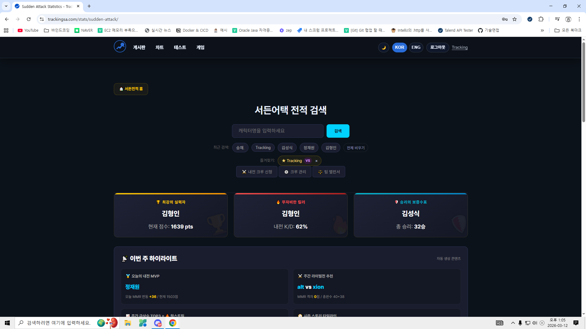
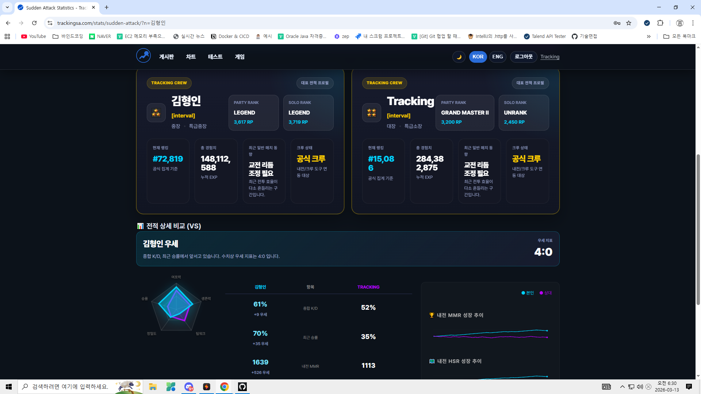
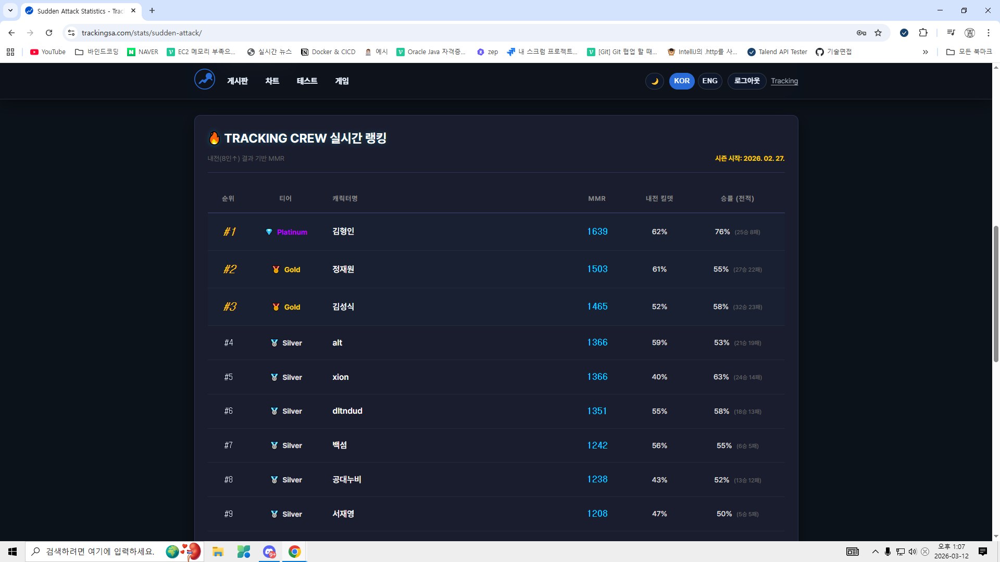
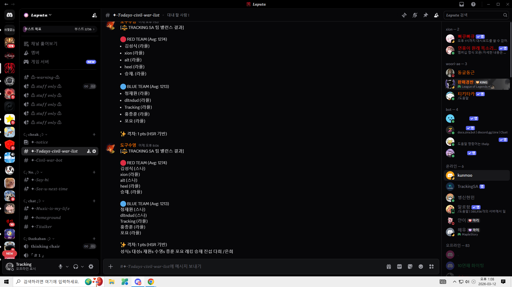

# Tracking SA (Feb 2026 – Present)

※ 실제 서비스 코드는 보안 및 운영 안정성을 위해 비공개 레포지토리로 관리하고 있으며,

본 레포지토리는 포트폴리오 목적으로 구조와 핵심 기능 중심으로 정리한 공개 버전입니다.

`서든어택 전적 검색`을 핵심 제품으로 운영하면서 반복 조회가 많은 실제 사용 흐름에 맞춰 구조 재편, 검색 UX 개선, 캐시 정책 설계를 진행했습니다.

단순 기능 추가보다 `대표 제품 재정의`, `stats 도메인 분리`, `VS 비교·라이벌 분석 강화`, `운영 호환성을 고려한 공개 경로 유지`에 집중했습니다.

## 프로젝트 역할

- 역할: 기획, 프론트엔드 개발, 서버리스 백엔드 연동, 구조 설계, 배포/운영
- `서든어택 전적 검색`을 프로젝트의 대표 제품으로 재정의
- `games` 하위 기능이던 구조를 `stats` 도메인 중심으로 재편
- 반복 검색이 많은 서비스 특성에 맞춰 캐시 정책과 검색 UX 개선
- `src -> public` 빌드 구조와 DDD 경계를 유지하면서 기능 확장

## 주요 기능

- 공식 API 기반 서든어택 전적 검색
- 최근 매치 기록 / 시즌 기준 통계 / VS 비교
- 전적 기반 라이벌 분석 / 상성 확인
- 크루 랭킹 / 팀 밸런서 / 내전 보조 도구
- 최근 검색 / 즐겨찾기 / 즐겨찾기 기반 VS 비교
- 게시판, 테스트형 기능, 실용 도구를 포함한 허브 구조

## 기술적 구현

### 1. Stats Domain Migration

서든어택 기능이 일반 `games` 하위 페이지 수준을 넘어서면서, 내부 소스 오브 트루스를 `src/domains/stats/sudden-attack` 으로 이동했습니다.

- 공식 공개 경로: `/stats/sudden-attack/`
- 호환 경로: `/games/sudden-attack/`
- 기존 외부 링크와 검색엔진 유입이 끊기지 않도록 호환 경로는 유지

### 2. Pragmatic DDD

기능을 `domain`, `application`, `infra`, `ui` 계층으로 나누고, 비대해진 서비스 로직을 단계적으로 분리했습니다.

예를 들어 서든어택 도메인에서는:
- 시즌 뷰 조립
- 탈주 처리
- 트렌드 계산
- 프로필 로딩
- 캐시 조회 / query orchestration

를 각각 별도 단위로 나눠 유지보수 가능성을 높였습니다.

### 3. Search UX And Cache Policy

전적 검색은 같은 유저를 반복 조회하는 패턴이 많기 때문에, 단순 검색 기능보다 재방문 UX와 캐시 정책이 중요했습니다.

적용한 개선:
- 최근 검색
- 즐겨찾기
- 즐겨찾기에서 바로 VS 비교
- 프로필 캐시 5분 TTL

현재 캐시 정책:
- 캐시 없음: fresh fetch
- 캐시 5분 이내: 캐시만 반환
- 캐시 5분 초과: 캐시 먼저 반환 후 백그라운드 재검증

## 시스템 구조

- Frontend: JavaScript (ES Modules), Web Components, Shadow DOM
- Serverless/API: Vercel/Cloudflare Functions, Discord Interactions, Firebase REST integration
- Data: Firebase Firestore, Nexon Open API
- Auth/Security: Firebase Auth, role-based access, Firestore Rules
- Hosting: Cloudflare Pages
- Build & Automation: Python-based static site build pipeline, GitHub Actions, Cloudflare Worker Cron
- Content/SEO: search index, RSS, sitemap, static content generation
- Testing: Node test, Playwright

프로젝트 원칙:
- `src` 를 source of truth 로 사용
- `public` 은 빌드 산출물로 관리
- 공개 경로 변경 시 alias 를 유지해 서비스 안정성을 우선

## Why This Project Matters

이 프로젝트는 단순 CRUD 중심의 학습용 프로젝트가 아니라,

- 실제 외부 API(Nexon Open API)를 연동한 서비스
- 반복 조회 패턴이 존재하는 검색 제품
- 실제 사용자 트래픽이 발생하는 운영 중 서비스

를 기반으로 구조 개선과 기능 확장을 진행한 프로젝트입니다.

특히 `서든어택 전적 검색` 기능을 중심으로

- 제품 방향 재정의
- stats 도메인 분리
- 캐시 정책 개선
- 검색 UX 개선

을 단계적으로 수행했습니다.

## 실제 운영 지표

2026-03 기준 Google Analytics 최근 30일 운영 지표:
- 활성 사용자 약 285명
- 조회수 약 7.5K
- 이벤트 수 약 18K
- 디스코드 기반 실사용 흐름 존재

특히 서든어택 전적 검색은 반복 검색과 비교 기능 수요가 실제로 발생하는 핵심 기능으로 운영 중입니다.

## 트러블슈팅

- AI API 403 이슈
  직접 호출 환경에서 실패하던 요청을 서버리스 경유 구조로 재정리해 안정적으로 응답하도록 조정했습니다.
- `src -> public` 동기화 문제
  source of truth를 `src`로 고정하고, `public`을 산출물로 관리하는 규칙과 체크 스크립트를 붙여 배포 산출물 드리프트를 줄였습니다.
- 반복 조회 성능 문제
  전적 검색 특성상 동일 유저 재조회가 많아 5분 TTL 캐시와 재검증 흐름을 분리해 체감 속도와 API 호출 부담을 함께 조정했습니다.

## Links

- Live: [https://trackingsa.com](https://trackingsa.com)
- Main Service: [https://trackingsa.com/stats/sudden-attack/](https://trackingsa.com/stats/sudden-attack/)
- Developer: [https://github.com/HanBeom98](https://github.com/HanBeom98)

## Screenshots

### Main Search Experience

서든어택 전적 검색 메인 화면입니다. 검색창, 최근 검색, 즐겨찾기, 실시간 랭킹을 한 화면에서 연결했습니다.

### VS Comparison

두 유저의 프로필, 핵심 지표, 성장 추이를 한 번에 비교할 수 있도록 VS 모드를 구성했습니다.

### Crew Ranking

내전 기준 랭킹과 핵심 지표를 빠르게 스캔할 수 있도록 테이블 중심으로 설계했습니다.

### Real Usage In Discord

웹 기능으로 끝내지 않고, 디스코드 봇을 통해 팀 밸런서 결과가 실제 사용 흐름에 연결되도록 운영했습니다.

